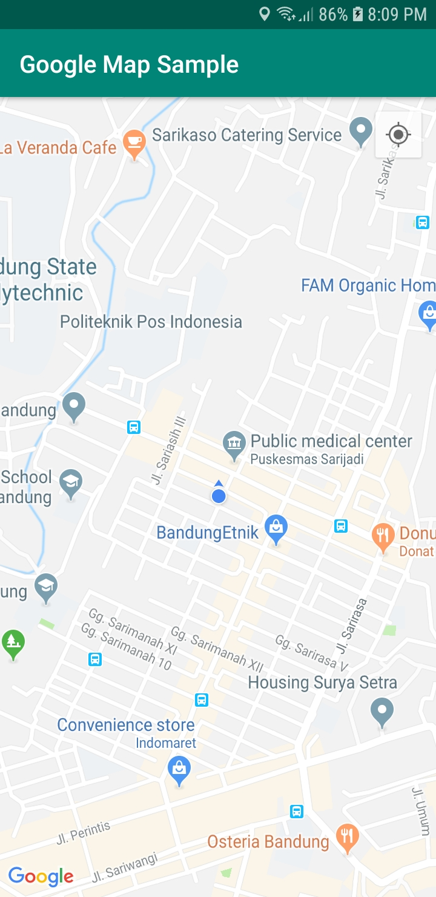
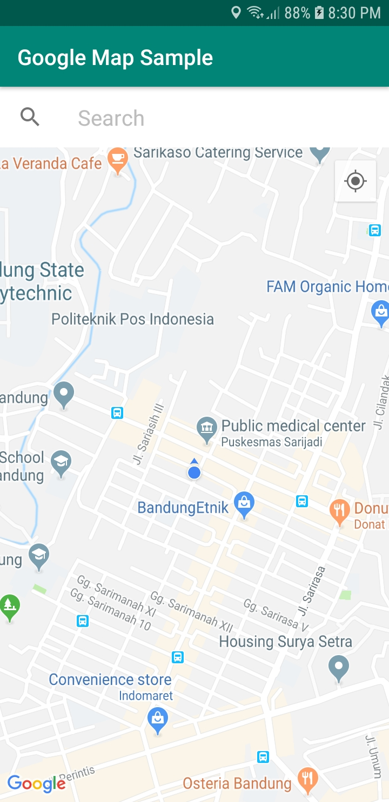
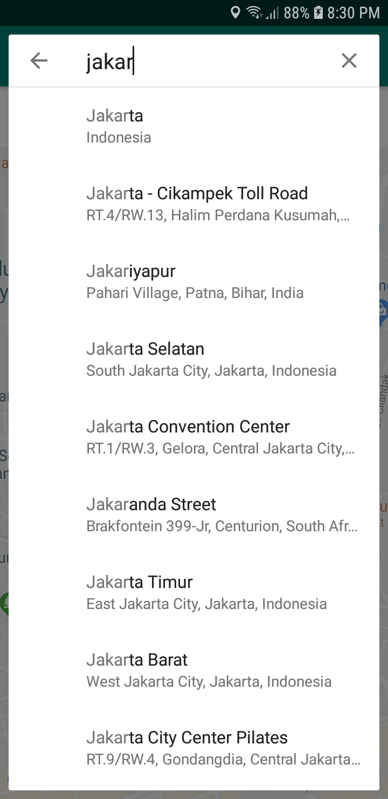
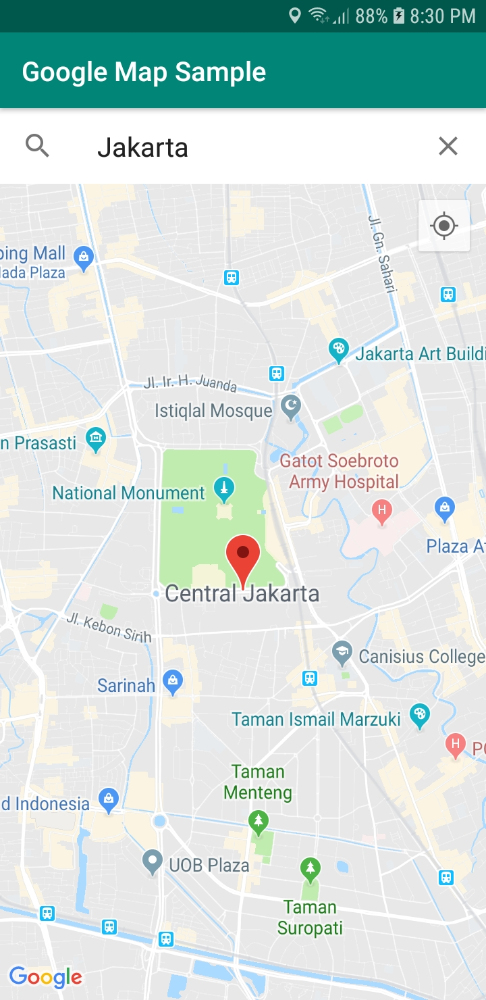
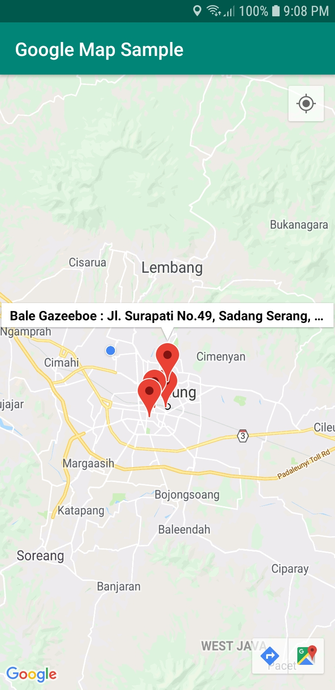
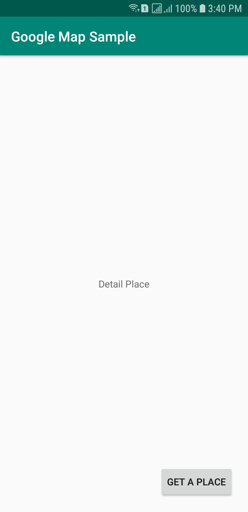

# Google Maps V2 Sample


[](https://github.com/rrifafauzikomara/GoogleMapsSample)

Sample app who implement all API Google Maps V2

### Config
To run this example, you should add your API KEY first for MAPS into ***google_maps_api.xml*** file.

## Branch master
### Screenshot 1 📸
<pre>

</pre>

In this branch, add API Google Maps for get current location (real time)

## Branch add_api_place_autocomplete
### Screenshot 2 📸
<pre>
    
</pre>

In this branch, add API Google Maps for Place Autocomplete

## Branch add_api_place_search
### Screenshot 3 📸
<pre>

</pre>

In this branch, add API Google Maps Place Search restaurant in Bandung with radius 1500 meters 

## Branch add_api_place_picker
### Screenshot 4 📸
<pre>
      
</pre>

In this branch, add API Google Maps for Place Picker

## Author

* **R Rifa Fauzi Komara**

Don't forget to follow me, fork and give me a ⭐


## License

```
MIT License

Copyright (c) [2020] [R Rifa Fauzi Komara]

Permission is hereby granted, free of charge, to any person obtaining a copy
of this software and associated documentation files (the "Software"), to deal
in the Software without restriction, including without limitation the rights
to use, copy, modify, merge, publish, distribute, sublicense, and/or sell
copies of the Software, and to permit persons to whom the Software is
furnished to do so, subject to the following conditions:

The above copyright notice and this permission notice shall be included in all
copies or substantial portions of the Software.

THE SOFTWARE IS PROVIDED "AS IS", WITHOUT WARRANTY OF ANY KIND, EXPRESS OR
IMPLIED, INCLUDING BUT NOT LIMITED TO THE WARRANTIES OF MERCHANTABILITY,
FITNESS FOR A PARTICULAR PURPOSE AND NONINFRINGEMENT. IN NO EVENT SHALL THE
AUTHORS OR COPYRIGHT HOLDERS BE LIABLE FOR ANY CLAIM, DAMAGES OR OTHER
LIABILITY, WHETHER IN AN ACTION OF CONTRACT, TORT OR OTHERWISE, ARISING FROM,
OUT OF OR IN CONNECTION WITH THE SOFTWARE OR THE USE OR OTHER DEALINGS IN THE
SOFTWARE.
```
